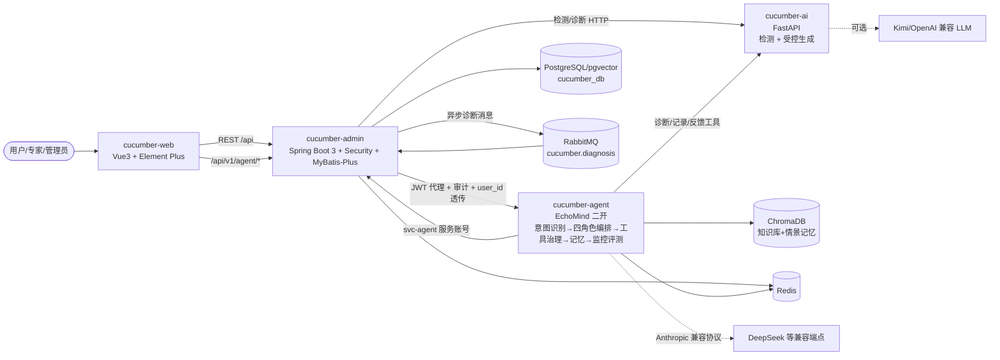

# 黄瓜叶片病害智能识别与可信辅助诊断平台

> 面向设施黄瓜种植的病害辅助诊断系统：上传叶片照片，由改进 YOLO 检测病斑、检索农技知识库并受控生成带来源追溯的诊断报告；支持用户纠错反馈、专家复核、知识库与模型版本管理，形成"诊断 → 反馈 → 复核 → 迭代"的闭环。

## 系统架构



## 技术栈

| 层 | 模块 | 技术 |
| --- | --- | --- |
| 前端 | cucumber-web | Vue 3.5 + TypeScript + Vite 5 + Element Plus 2.8 + Pinia + Vue Router + ECharts |
| 业务后端 | cucumber-admin | Java 17 + Spring Boot 3.3.4 + Spring Security(JWT) + MyBatis-Plus + PostgreSQL + Redis + RabbitMQ + springdoc-openapi |
| AI 服务 | cucumber-ai | Python 3.9 + FastAPI + Pydantic v2 + OpenAI 兼容 SDK（Kimi）+ 可插拔 ultralytics 推理 |
| 智能体编排 | cucumber-agent | Python 3.9 + FastAPI + Anthropic 兼容 SDK（默认 DeepSeek）+ ChromaDB + Redis，基于 EchoMind 领域二开 |
| 基础设施 | docker-compose | PostgreSQL 16(pgvector) + Redis 7 + RabbitMQ 3 + ChromaDB 0.5.23 + Nginx（+ 可选 Prometheus，profiles: monitor） |

## 快速开始

### 方式一：Docker Compose（推荐）

```bash
# ⚠️ 智能体对话链路（/api/v1/agent/chat）必须配置 Anthropic 兼容协议 Key：
export ANTHROPIC_API_KEY=sk-...        # DeepSeek 等 Anthropic 兼容端点的 Key
docker compose up -d --build
# 可选监控栈：docker compose --profile monitor up -d
```

- 前端入口：http://localhost:8088
- 后端 API 文档：http://localhost:8080/swagger-ui.html
- 智能体服务文档：http://localhost:8002/docs
- RabbitMQ 管理台：http://localhost:15672（guest/guest）

### 方式二：本地三端分别启动

前置：本地需有 PostgreSQL（建库 `cucumber_db` 并执行 `cucumber-admin/src/main/resources/db/schema.sql`）与 Redis。

```bash
# 1. AI 服务（Python 3.9+）
cd cucumber-ai
pip install -r requirements.txt
LLM_PROVIDER=mock uvicorn app.main:app --port 8000

# 2. 业务后端（JDK 17 + Maven 3.8+）
cd cucumber-admin
mvn spring-boot:run        # 端口 8080，首启自动初始化账号与示例知识库

# 3. 前端（Node 18+）
cd cucumber-web
npm install
npm run dev                # 端口 5173，已配置 /api 与 /files 代理到 8080

# 4. 智能体服务（可选，Python 3.9+；/chat 必须配 ANTHROPIC_API_KEY）
cd cucumber-agent
python -m venv .venv && .venv/Scripts/pip install -r echomind/requirements.txt
# 在 cucumber-agent/.env 写入 ANTHROPIC_API_KEY（见 cucumber-agent/README.md）
cd echomind && ../.venv/Scripts/python -m uvicorn api.main:app --port 8002
```

## 默认账号

| 账号 | 密码 | 角色 | 权限说明 |
| --- | --- | --- | --- |
| admin | Admin@123 | ADMIN | 全部权限（用户/角色/知识库/反馈复核/模型管理/全部诊断记录/智能体管理） |
| expert | Expert@123 | EXPERT | 知识库管理、反馈复核、模型管理、全部诊断记录、智能体监控/评测/Skills |
| user | User@123 | USER | 上传诊断、查看自己的记录、查询知识库、智能体对话 |
| svc-agent | SvcAgent@123（env: SVC_AGENT_PASSWORD） | SERVICE | 智能体服务账号：仅诊断记录查询与反馈创建，供 cucumber-agent 工具层调用 |

> 密码在首次启动时由 `DataInitializer` 用 BCrypt 现场编码写入，仓库中不保存任何哈希。

## 目录结构

```
cucumber-diagnosis-platform/
├── docker-compose.yml            # 一键编排：db/redis/rabbitmq/admin/ai/web/chromadb/agent（prometheus 走 monitor profile）
├── deploy/prometheus.yml         # 可选监控栈配置
├── cucumber-admin/               # Spring Boot 业务后端
│   ├── Dockerfile                # 多阶段构建（maven -> jre）
│   └── src/main/
│       ├── java/com/portfolio/cucumber/
│       │   ├── common/           # Result/分页/异常处理/健康检查
│       │   ├── config/           # Security/MyBatis-Plus/CORS/OpenAPI/Redis
│       │   ├── security/         # JWT 工具、过滤器、LoginUser
│       │   ├── modules/          # system / diagnosis / knowledge / model / stats / agent(智能体代理+审计)
│       │   ├── integration/      # ai(RestClient) / mq(RabbitMQ 异步诊断)
│       │   └── DataInitializer   # 默认账号(含 svc-agent)/角色权限/示例知识库
│       └── resources/
│           ├── application.yml   # 全部配置支持环境变量覆盖
│           └── db/schema.sql     # PostgreSQL 建表脚本（含 agent_session/agent_message 审计表）
├── cucumber-ai/                  # FastAPI AI 服务
│   ├── app/
│   │   ├── routers/              # detect / diagnose / knowledge / eval
│   │   ├── services/             # detector / retriever / llm / report(受控生成)
│   │   └── schemas/              # Detection / Evidence / DiagnosisReport
│   ├── data/disease_knowledge.json
│   └── tests/test_smoke.py
├── cucumber-agent/               # 智能体编排服务（EchoMind 二开，端口 8002）
│   ├── README.md                 # 含 ANTHROPIC_API_KEY 配置说明与母版来源声明
│   └── echomind/
│       ├── api/main.py           # FastAPI 入口（/chat /monitor /eval/run /skills /knowledge /trace）
│       ├── agents/               # 四角色编排 + 领域工具 + platform_client（平台 HTTP 客户端）
│       ├── core/                 # 三路融合意图识别 / Skills 加载器
│       ├── mcp/                  # 工具治理（缓存/熔断/改写重排）+ Chroma 知识库
│       ├── memory/               # Redis 工作记忆 + Chroma 情景记忆/用户画像
│       ├── monitor/              # Z-score 异常检测 + 路由罚分回写
│       ├── evaluation/           # LLM-as-Judge 六维评测 + 回归检测
│       ├── skills/               # 4 个领域 Skill（诊断/防治/用药/升级，9 段式 SOP）
│       ├── data/cucumber_knowledge.json  # 28 条黄瓜病害知识种子（源自论文知识库）
│       └── tests/                # pytest 13 用例
└── cucumber-web/                 # Vue3 前端
    ├── src/api/                  # 接口封装（axios 拦截器解包 Result；agent.ts 做响应归一化）
    ├── src/views/                # 登录/看板/诊断/记录/复核/知识库/模型/系统管理/agent(对话/监控/管理)
    └── nginx.conf                # history 路由 + /api、/files 反代
```

## 成熟代码插入点（论文 AI 部分迁移位置）

| 已有成果 | 插入位置 | 说明 |
| --- | --- | --- |
| E2_gfix 改进 YOLO11n 检测权重 | `cucumber-ai/app/services/detector.py` | 权重放到 `WEIGHTS_PATH`（默认 `weights/E2_gfix.pt`）即自动加载走真实推理，无需改代码；同时在管理端"模型版本"页登记并激活 |
| agent_v1 LangGraph 受控生成工作流 | `cucumber-ai/app/services/report.py` | 替换 `generate_report` 内部实现（检索→生成→校验→回检重写），对外 `POST /api/v1/diagnose` 接口不变；当前的"JSON 校验 + source_id 合法性校验 + 重试 + 骨架降级"可作为工作流的兜底 |
| 真实农技知识库 | `cucumber-ai/data/disease_knowledge.json` 与 admin 的 `knowledge_entry` 表 | JSON 供 AI 服务检索，表数据供业务端管理与来源展示，`source_id` 为两侧对齐键 |
| pgvector 向量检索 | `cucumber-ai/app/services/retriever.py` | 关键词检索已预留替换点，compose 中数据库镜像已带 pgvector |
| 小红书 Agent 项目的评测/监控机制 | `cucumber-ai/app/routers/eval.py` 与 admin `integration/` | eval 已给出可解析率/引用合法率指标骨架，替换 `SAMPLES` 为真实标注集即可；admin 侧可新增定时任务拉取指标入库 |
| 真实 LLM（Kimi） | `cucumber-ai/app/services/llm.py` | 设 `LLM_PROVIDER=kimi` 与 `KIMI_API_KEY` 即切换，报告校验/重试/回退逻辑不变 |

## API 文档

- 业务后端 Swagger UI：`/swagger-ui.html`（如 http://localhost:8080/swagger-ui.html ），支持 Bearer Token 在线调试。
- AI 服务自带 OpenAPI 文档：http://localhost:8000/docs 。

## 环境要求

| 依赖 | 版本 |
| --- | --- |
| JDK | 17+ |
| Maven | 3.8+ |
| Node.js | 18+ |
| Python | 3.9+ |
| Docker / Docker Compose | 20.10+ / v2（仅容器化部署需要） |

## 核心链路

登录（JWT）→ 上传叶片图片 → 后端存图并调用 AI 服务（同步或 RabbitMQ 异步）→ 返回病斑框与五段式诊断报告（诊断结论/依据/农艺措施/化学防治/安全注意）→ 来源编号可追溯知识原文 → 历史记录可提交"诊断有误"反馈 → 专家复核闭环 → 看板统计（累计/今日诊断、病害分布、反馈准确率）。

智能体链路（cucumber-agent，EchoMind 二开）：对话消息 → 三路融合意图识别（LLM 70% + 向量 20% + 关键词 10%）→ 四角色 Agent 路由（诊断/防治/用药/人工升级，支持主辅并行 + Composer 合并）→ 工具治理层（TTL 缓存/熔断/超时/查询改写重排）调平台 API → 带来源编号的回答 → Redis/Chroma 三层记忆 → 在线监控（Z-score 异常 + 路由罚分）与 LLM-as-Judge 评测。

## 演示脚本

1. 登录 `user/User@123`，进入「智能体对话」页。
2. 上传一张叶片照片（对话输入框左侧按钮），发送"帮我看看这是什么病"——观察意图徽标（disease_diagnosis）、主 Agent（diagnosis）、工具轨迹抽屉中的 `diagnose_image` 调用。
3. 继续问"霜霉病怎么治？"——路由到防治 Agent，回答带来源编号（RAG 徽标亮起）。
4. 再问"打完药几天能采收？"——用药 Agent 给出安全间隔期与禁限用边界提示。
5. 发送"判断不准，转人工专家"——升级 Agent 生成结构化交接单并创建专家复核反馈（escalated 徽标）。
6. 用 `admin/Admin@123` 进「智能体监控」看 Agent/工具成功率与熔断状态；进「智能体管理」跑一次默认评测用例，查看六维评分报告。

## 母版来源声明

`cucumber-agent/echomind/` 基于 EchoMind（https://github.com/Biscuit-AI531/EchoMind，客服多 Agent 编排运行时，无 LICENSE）vendor 二开：保留意图三路融合、角色契约编排、工具治理、三层记忆、监控评测机制；替换为黄瓜病害领域的意图体系、四角色、平台工具、28 条知识种子（源自论文第六章知识库）与 4 个领域 Skill。

> 说明：AI 检测与诊断生成部分以"插入点 + Mock 降级"形式交付骨架，未包含任何已训练权重或"已完成训练"的产出；插入真实权重与工作流后即可端到端运行。
