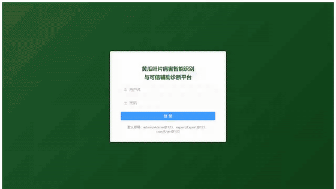
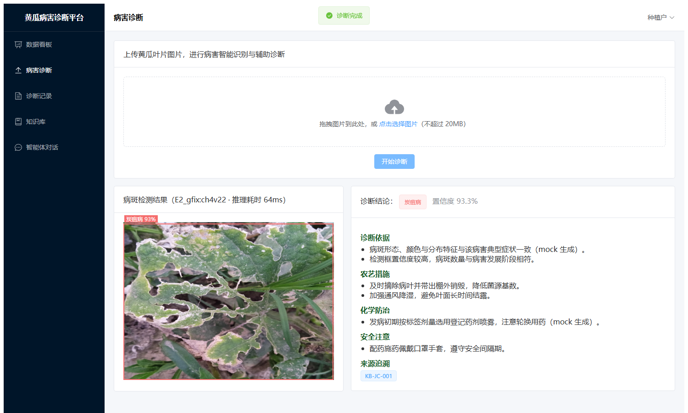
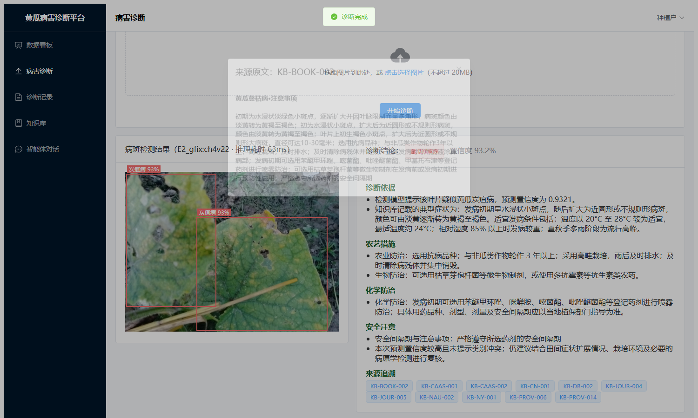
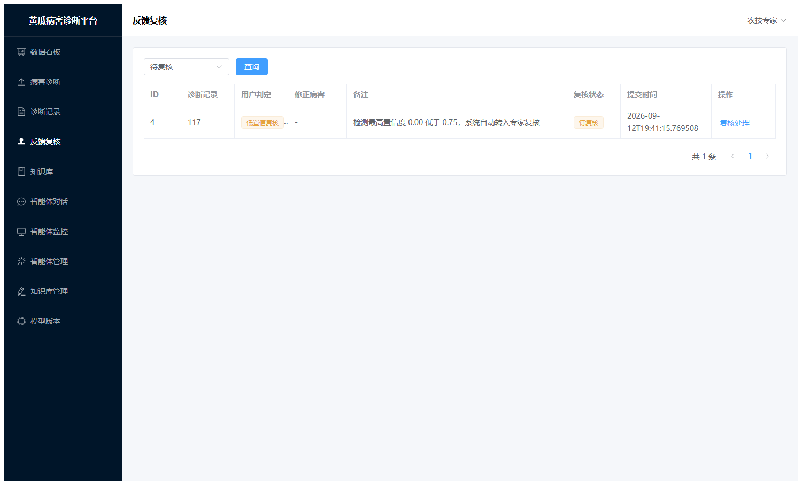
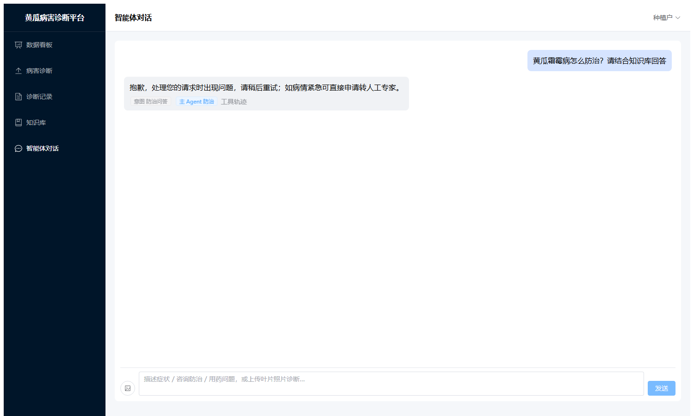
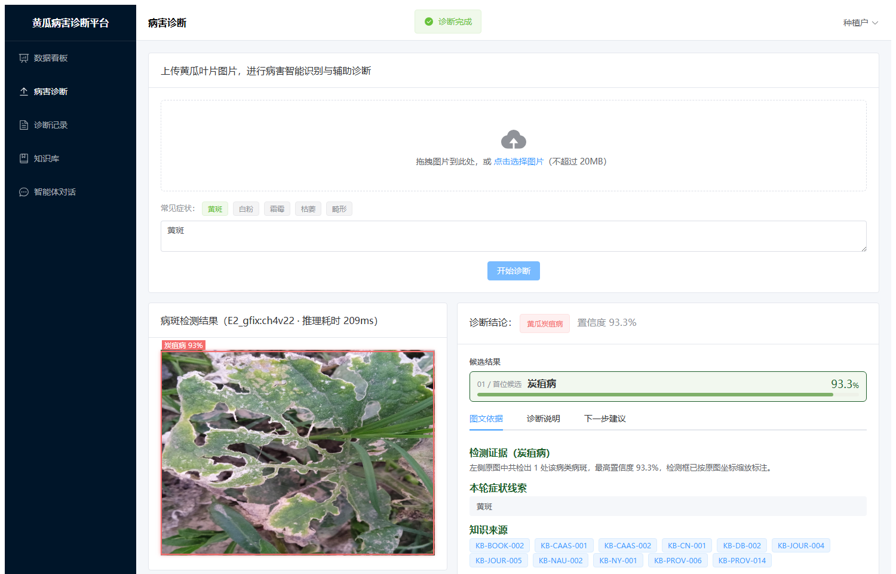
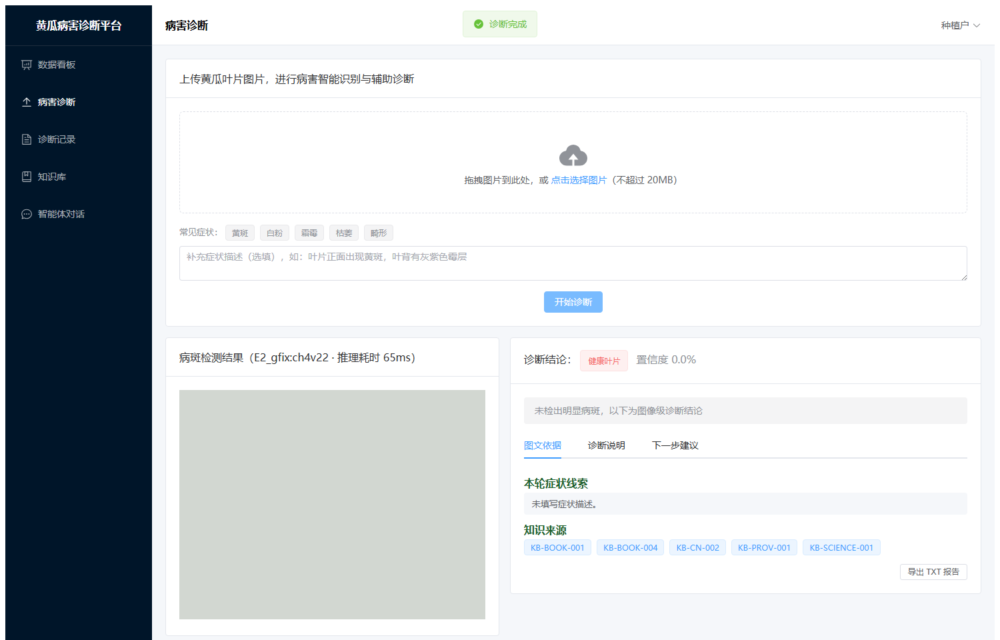
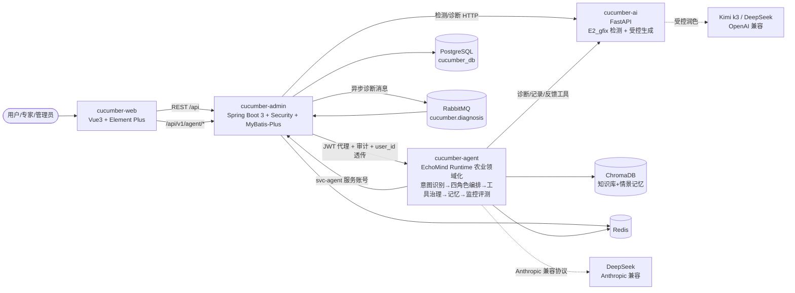

# 🥒 Cucumber AI Diagnosis Platform

> 基于计算机视觉、多模态知识增强与自主 Agent Runtime 构建的农业 AI 诊断平台。系统以自主设计的 **EchoMind 多 Agent 编排运行时**为智能中枢，融合改进 YOLO、RAG、LLM 受控生成与专家反馈机制，实现从图像识别、知识检索到智能决策的完整 AI 应用闭环。
>
> 当前版本 **v0.3.0**：检测与报告均为**真实链路**（内置冻结权重与训练侧运行时），项目状态详见 [PROJECT_STATUS.md](PROJECT_STATUS.md)。

```text
黄瓜叶片图像输入
        ↓
改进 YOLO 病害检测
        ↓
农业知识检索与证据构建
        ↓
EchoMind 多 Agent 协作诊断
        ↓
可信报告生成与事实校验
        ↓
用户反馈 / 专家复核 / 持续迭代
```

项目集中体现一条完整的 AI 全栈技术路线：

- **视觉模型**：定位病斑，输出病害类别、检测框、置信度与推理耗时
- **知识增强**：检索论文知识库，以可追溯证据约束诊断内容
- **Agent 编排**：通过 EchoMind 完成意图识别、路由、工具调用、记忆与评测
- **业务闭环**：连接用户诊断、专家复核、知识管理、模型管理和反馈迭代





| 来源追溯 | 低置信自动复核 | 农技诊断 Agent |
| --- | --- | --- |
|  |  |  |

| 候选排序与三栏结果区（09-20 重构，实证） | 空白图降级提示（实证） |
| --- | --- |
|  |  |

## 项目背景

传统农业病害诊断依赖人工经验，普遍面临专业知识门槛高、诊断效率低、信息来源分散以及建议难以标准化等问题。本项目将视觉检测结果作为诊断起点，以农业知识证据约束大模型生成，并通过 Agent 编排和专家反馈机制提高结果的可解释性、可追踪性与可持续优化能力。

## 系统架构



## 技术栈

| 层 | 模块 | 技术 |
| --- | --- | --- |
| 前端 | cucumber-web | Vue 3.5 + TypeScript + Vite 5 + Element Plus 2.8 + Pinia + Vue Router + ECharts |
| 业务后端 | cucumber-admin | Java 17 + Spring Boot 3.3.4 + Spring Security(JWT) + MyBatis-Plus + PostgreSQL + Redis + RabbitMQ + springdoc-openapi |
| AI 服务 | cucumber-ai | Python 3.9 + FastAPI + Pydantic v2 + torch 2.8 + **vendor 训练侧运行时（ultralytics 8.4.90 + 融合模块）** + OpenAI 兼容 SDK（Kimi k3 / DeepSeek） |
| 智能体编排 | cucumber-agent | Python 3.9 + FastAPI + Anthropic 兼容 SDK（DeepSeek）+ ChromaDB + Redis，基于自主设计的 EchoMind Runtime 进行农业领域适配 |
| 基础设施 | docker-compose | PostgreSQL 16(pgvector) + Redis 7 + RabbitMQ 3 + ChromaDB 0.5.23 + Nginx（+ 可选 Prometheus，profiles: monitor） |

## 核心能力

### 1. AI 病害视觉检测

上传黄瓜叶片图片后，系统调用论文冻结的改进 YOLO11n（E2_gfix）定位病斑，并返回病害类别、检测框、置信度、模型版本和推理耗时。图像内容哈希用于识别重复上传，避免重复推理与重复记录。

```text
Image → E2_gfix Detection → Disease Candidate → Diagnosis Pipeline
```

### 2. RAG 农业知识增强

视觉模型负责回答“可能是什么病”，知识增强链路进一步为“为什么这样判断、如何处理、有哪些安全注意事项”提供依据。系统围绕病害特征、防治方法与农业规范检索知识，并将合法 `source_id` 注入生成上下文，使诊断结论能够追溯到知识库原文。

```text
用户问题 / 检测结果 → 查询改写 → 知识检索 → 证据重排 → 上下文注入 → 诊断生成
```

### 3. EchoMind 多 Agent 智能诊断层

EchoMind 是本项目自主设计的多 Agent 编排运行时，用于将意图识别、知识检索、路由决策、工具治理、记忆、监控和评测串成完整链路，而非仅进行 Prompt 拼接。在通用 Runtime 之上，`cucumber-agent` 完成农业领域适配，形成诊断、防治、用药和人工升级四类角色协作。

```text
用户请求
   ↓
三路融合意图识别
   ↓
路由决策（单 Agent / 主辅并行）
   ↓
工具调用 + RAG 检索
   ↓
Composer 响应合并
   ↓
记忆回写
   ↓
Monitor 监控 / Evaluation 评测反馈
```

EchoMind 的核心设计包括：

- 多 Agent 路由与角色契约编排
- 工具缓存、熔断、查询改写与结果重排
- Redis / ChromaDB 三层记忆管理
- Skills 动态注入与农业领域能力扩展
- 在线 Monitor、异常检测与路由罚分
- LLM-as-Judge 自动评测

### 4. 可信诊断与专家反馈闭环

系统不直接输出自由生成文本，而是执行“检索 → 骨架 → 润色 → 12 项事实一致性校验 → 纠错重润 → 骨架回退”的受控生成流程。低置信或无检出的诊断自动进入专家复核，用户也可主动提交纠错反馈，最终形成“诊断 → 反馈 → 复核 → 迭代”的业务闭环。

```text
检测结果 → 知识证据 → 结构化骨架 → LLM 受控润色 → 事实校验 → 可追溯诊断报告
```

## Agent Framework Evolution

EchoMind 提供通用智能体基础设施，`cucumber-agent` 负责将其意图体系、角色、工具、知识、记忆与评测能力适配到农业诊断场景：

```text
EchoMind 通用多 Agent Runtime
              ↓
农业领域意图 / 角色 / Tools / Skills 适配
              ↓
        cucumber-agent
              ↓
黄瓜病害识别、知识增强与专家复核业务系统
```

这条演进路径体现了从通用 Agent 基础设施到垂直领域 AI 应用的工程化落地能力。

## 快速开始

### 方式一：Docker Compose（推荐）

```bash
# ⚠️ 智能体对话链路（/api/v1/agent/chat）必须配置 Anthropic 兼容协议 Key：
export ANTHROPIC_API_KEY=sk-...        # DeepSeek 等 Anthropic 兼容端点的 Key
# AI 报告润色链路（/api/v1/diagnose）配置（二选一）：
export KIMI_API_KEY=sk-...             # Kimi k3（默认，论文同端点）；或改用 DeepSeek：
# export DEEPSEEK_API_KEY=sk-... 并在 compose 中把 LLM_PROVIDER 改为 deepseek
docker compose up -d --build
# 可选监控栈：docker compose --profile monitor up -d
```

- 前端入口：http://localhost:8088
- 后端 API 文档：http://localhost:8080/swagger-ui.html
- 智能体服务文档：http://localhost:8002/docs
- RabbitMQ 管理台：http://localhost:15672（guest/guest）

### 方式二：本地三端分别启动

前置：本地需有 PostgreSQL（建库 `cucumber_db` 并执行 `cucumber-admin/src/main/resources/db/schema.sql`）与 Redis。

> **无 Docker 环境实测路径（2026-09-12 验收通过）**：便携 PostgreSQL 16.10（initdb -A trust -E UTF8 --locale=C，注意必须经 `pg_ctl start` 启动，直接跑 postgres.exe 会被管理员权限拒绝）+ 便携 Redis 5.0.14（`redis-server --port 6379`）即可满足前置依赖。完整验证记录见 [docs/验收报告_20260912.md](docs/验收报告_20260912.md)。

```bash
# 1. AI 服务（Python 3.9+；仓库已内置 E2_gfix 权重与 vendor 运行时，开箱即真实推理）
cd cucumber-ai
pip install -r requirements.txt
# 报告润色默认走 Kimi k3：在 .env 写入 LLM_PROVIDER=kimi 与 KIMI_API_KEY；
# 不配则回退 mock provider（确定性骨架，链路仍可联调）
uvicorn app.main:app --port 8000

# 2. 业务后端（JDK 17 + Maven 3.8+）
cd cucumber-admin
mvn spring-boot:run        # 端口 8080，首启自动初始化账号、角色权限与 28 条知识库

# 3. 前端（Node 18+）
cd cucumber-web
npm install
npm run dev                # 端口 5173，已配置 /api 与 /files 代理到 8080

# 4. 智能体服务（可选，Python 3.9+；EchoMind Runtime，/chat 必须配 ANTHROPIC_API_KEY）
cd cucumber-agent
python -m venv .venv && .venv/Scripts/pip install -r echomind/requirements.txt
# 在 cucumber-agent/.env 写入 ANTHROPIC_API_KEY（见 cucumber-agent/README.md）
cd echomind && ../.venv/Scripts/python -m uvicorn api.main:app --port 8002
```

## 默认账号

| 账号 | 密码 | 角色 | 权限说明 |
| --- | --- | --- | --- |
| admin | Admin@123 | ADMIN | 全部权限（用户/角色/知识库/反馈复核/模型管理/全部诊断记录/智能体管理） |
| expert | Expert@123 | EXPERT | 知识库管理、反馈复核、模型管理、全部诊断记录、智能体监控/评测/Skills |
| user | User@123 | USER | 上传诊断、查看自己的记录、查询知识库、智能体对话 |
| svc-agent | SvcAgent@123（env: SVC_AGENT_PASSWORD） | SERVICE | 智能体服务账号：仅诊断记录查询与反馈创建，供 cucumber-agent 工具层调用 |

> 密码在首次启动时由 `DataInitializer` 用 BCrypt 现场编码写入，仓库中不保存任何哈希。

## 论文资产集成现状

本平台与硕士论文《基于改进 YOLO 与受控生成的黄瓜叶部病害智能诊断研究》共用 AI 资产，**以下均已完成并通过运行验证**（证据见 PROJECT_STATUS.md 与 docs/验收报告）：

| 论文成果 | 集成位置 | 状态 |
| --- | --- | --- |
| E2_gfix 改进 YOLO11n 冻结权重（test301：P=92.48 / R=87.37 / mAP50=90.55） | `cucumber-ai/weights/E2_gfix.pt`（已入库）+ `app/services/detector.py` + `vendor/`（训练侧运行时 ultralytics 8.4.90 + 融合模块，checkpoint 必需） | ✅ 已接入：中文类别映射、CPU 推理 56-128ms、耗时透传展示；管理端"模型版本"页已登记激活 `E2_gfix:ch4v22`（含 sha256 与指标口径） |
| 第六章受控生成工作流（检索→骨架→润色→12 项校验→纠错重润→骨架回退） | `app/services/`：`report.py`（六步流水线）+ `skeleton.py` + `validators.py` + `prompts.py` + `knowledge_store.py` | ✅ 已迁移：12 项事实一致性校验逐字保留（幻觉率 0.22% 的口径基础）；prompt 原文保留；交付率 100% 的骨架回退机制保留；报告带 `report_status` 与 `uncertainty_note` |
| 论文知识库（4 病害 + 健康叶，28 个合法 source_id） | `cucumber-ai/data/disease_knowledge.json`（检索用嵌套结构）+ admin `knowledge_entry` 表（28 条扁平目录，`db/knowledge_seed.json` 种子） | ✅ 已对齐：报告引用的 source_id 全部可在业务库追溯原文；agent 知识库同源 |
| 真实 LLM | `app/services/llm.py` | ✅ 已联调：Kimi k3（论文同端点，默认）/ DeepSeek V4.1 Flash（备用，同流水线同校验）；401 不重试、指数退避、trust_env=False 与论文一致 |
| 低置信门控（rule A + 0.75 阈值 + 冲突 flag） | 证据构建（`report.py`）+ admin 诊断链路 | ✅ 已闭环：检测最高置信度 < 0.75（含无检出）自动创建 UNCERTAIN 复核单，专家复核页专用标签 |
| pgvector 向量检索 | `cucumber-ai/app/services/retriever.py` | ⏳ 后续规划（论文口径为类别显式映射，非向量检索；产品侧增强） |
| 评测数据补充（agent `/eval/run` 真实跑分） | `cucumber-agent/echomind/evaluation/` | ⏳ 后续规划 |

## 核心链路

登录（JWT）→ 上传叶片图片（内容哈希去重）→ E2_gfix 真实检测（病斑框/类别/置信度/耗时）→ 知识显式映射检索（28 个合法来源）→ 受控生成五段式报告（结论/依据/农艺/化防/安全 + 不确定性说明）→ 来源编号可追溯知识原文 → 低置信自动转专家复核 / 用户主动纠错反馈 → 专家复核闭环 → 操作日志与模型版本关联 → 看板统计。

智能体链路（cucumber-agent，EchoMind 农业领域化）：对话消息 → 三路融合意图识别 → 四角色 Agent 路由（诊断/防治/用药/人工升级，主辅并行 + Composer 合并）→ 工具治理层（缓存/熔断/改写重排）调平台 API → 带来源编号的回答 → Redis/Chroma 三层记忆 → 在线监控（Z-score + 路由罚分）与 LLM-as-Judge 评测。

## 演示脚本（3-5 分钟主链路）

1. 登录 `user/User@123`，进入「上传诊断」：选一张黄瓜叶片照片，点「开始诊断」——看**病斑框叠加、病害类别与置信度、推理耗时、模型版本**（如 `E2_gfix:ch4v22 · 推理耗时 64ms`）。
2. 右侧读**五段式诊断报告**（LLM 受控润色产物）：诊断结论/诊断依据/农艺措施/化学防治/安全注意——点开**来源标签**（如 KB-BOOK-002），弹窗显示知识库原文与级别。
3. 再传一次同一张图——提示"检测到重复上传，已为你打开原诊断记录"（内容哈希幂等）。
4. 进「诊断记录」：找到刚才的记录看详情抽屉；点「诊断有误」提交一条纠错反馈（选正确病害类型）。
5. 换 `expert/Expert@123` 进「专家复核」：处理刚才的反馈单；列表里还能看到系统自动创建的 **UNCERTAIN（低置信）复核单**（可现场传一张空白/无关图片触发：结论"健康叶片 0.0%"并自动生成复核单）。
6. 回到 `admin/Admin@123`：「模型版本」页看 E2_gfix 的登记信息与指标口径；Swagger（`/swagger-ui.html`）里调 `GET /api/v1/system/log` 看操作日志审计。

附：智能体演示——「智能体对话」页发送"霜霉病怎么治？"看意图/角色/RAG 徽标与工具轨迹抽屉；说"转人工专家"看升级交接单自动生成复核反馈。

## API 文档

- 业务后端 Swagger UI：`/swagger-ui.html`（如 http://localhost:8080/swagger-ui.html ），支持 Bearer Token 在线调试。
- AI 服务自带 OpenAPI 文档：http://localhost:8000/docs 。
- 智能体服务 OpenAPI 文档：http://localhost:8002/docs 。

## 环境要求

| 依赖 | 版本 |
| --- | --- |
| JDK | 17+ |
| Maven | 3.8+ |
| Node.js | 18+ |
| Python | 3.9+ |
| Docker / Docker Compose | 20.10+ / v2（仅容器化部署需要） |

## 目录结构

```
cucumber-diagnosis-platform/
├── PROJECT_STATUS.md             # 三段式真实项目状态（已完成/正在开发/后续规划）
├── docs/
│   ├── 验收报告_20260912.md      # 全栈验收记录（浏览器 17 项 + 异常 17 项全过）
│   └── screenshots/              # 本文档截图（均为真实运行截取）
├── docker-compose.yml            # 一键编排（Docker 环境）
├── cucumber-admin/               # Spring Boot 业务后端（JWT/RBAC/诊断/反馈/知识库/模型/统计/智能体代理审计）
│   └── src/main/resources/db/    # schema.sql + knowledge_seed.json（28 条知识种子）
├── cucumber-ai/                  # FastAPI AI 服务
│   ├── app/services/             # detector / e2_loader / report / skeleton / validators / prompts / knowledge_store / llm / retriever
│   ├── vendor/                   # 训练侧运行时副本（ultralytics 8.4.90 + 融合模块，E2_gfix checkpoint 必需）
│   ├── weights/E2_gfix.pt        # 论文冻结权重（已入库，sha256 d9e4ce25…）
│   ├── data/disease_knowledge.json  # 论文嵌套知识库（28 个合法 source_id）
│   └── tests/                    # pytest 26 项（含受控生成迁移测试）
├── cucumber-agent/               # EchoMind Runtime 的农业领域应用（端口 8002）
└── cucumber-web/                 # Vue3 前端（诊断/记录/复核/知识库/模型/系统/智能体）
```

## EchoMind 与 cucumber-agent

[EchoMind](https://github.com/Biscuit-AI531/EchoMind) 是自主设计的通用多 Agent 编排运行时，负责意图识别、角色契约编排、工具治理、三层记忆、监控与评测。`cucumber-agent/echomind/` 将该 Runtime 集成到本项目，并适配为黄瓜病害领域的意图体系、四类 Agent 角色、平台工具、28 条知识种子（源自论文第六章知识库）与 4 个领域 Skill。

## 状态与边界说明

- 检测（E2_gfix）与报告（受控生成）均为**真实链路**；LLM 未配置时自动降级为确定性骨架（`report_status=fallback_to_skeleton`），链路始终可交付。
- Docker compose 编排与 RabbitMQ 异步诊断链路**尚未在本机验证**（本机无 Docker，当前均为便携件本地直跑）；其余链路均有浏览器级与接口级验证记录（docs/验收报告_20260912.md）。
- 本项目为持续开发中的秋招作品集项目，不声称商业落地或大规模生产验证；指标数字均标注口径（见模型版本页与 PROJECT_STATUS.md）。

## 多模态融合链路

视觉模型负责感知，LLM 负责知识推理，两者通过结构化 schema 汇合，而非让 LLM 直接看图猜病：

```text
叶片图像
   ↓
改进 YOLO11n（E2_gfix）检测：病斑框 / 类别 / 置信度（cucumber-ai /detect）
   ↓
结构化病害表征（disease schema）：rule A 最高置信框定图像级类别，
   低置信(<0.75)与类别冲突双 flag（report.py build_evidence）
   ↓
RAG 知识检索：类别显式映射 28 个合法 source_id（knowledge_store.py，
   论文口径；对话侧另有 Chroma 向量检索 + 查询改写 + 重排）
   ↓
LLM 受控报告生成：只能润色 4 个 editable 字段，
   7 个 protected 字段程序回填（prompts.py / report.py）
   ↓
Schema / 来源校验：12 项事实一致性校验（validators.py），
   失败纠错重润 1 次，再失败骨架回退
   ↓
置信度分流：正常发布 / 低置信或冲突自动转专家复核（UNCERTAIN 复核单）
```

## RAG 来源追溯示例

请求与响应结构与 `cucumber-ai/app/schemas/` 的 `DiagnoseRequest` / `DiagnosisReport` 一一对应（下例为真实链路的典型形态，`report_status=polished` 表示 LLM 润色通过 12 项校验）：

```jsonc
// POST /api/v1/diagnose 请求（检测框来自 /detect 的真实输出）
{
  "detections": [
    {"x1": 122.5, "y1": 87.0, "x2": 301.2, "y2": 266.8, "confidence": 0.893, "label": "霜霉病"}
  ],
  "symptoms": ["叶背灰黑色霉层", "叶面黄褐色多角形病斑"]
}

// 响应（五段式 + 来源追溯 + 状态）
{
  "disease_type": "黄瓜霜霉病",
  "confidence": 0.893,                       // 图像检测框置信度，LLM 不可修改（protected）
  "basis": [
    "检测模型预测该叶片疑似黄瓜霜霉病（置信度 0.8930）。",
    "知识库记载的典型症状：叶面初期为水浸状淡绿色小斑点……"
  ],
  "agronomy": ["农业防治：选用抗病品种；与非瓜类作物轮作 3 年以上……"],
  "chemical": ["化学防治：发病初期可选用烯酰吗啉类、氰霜唑等登记药剂……（具体剂量以标签为准）"],
  "safety": ["安全间隔期与注意事项：采收前按标签规定停止用药……"],
  "source_ids": ["KB-DM-001", "KB-DM-003", "KB-DM-004"],   // 知识库来源编号，前端可弹窗查原文
  "uncertainty_note": null,                  // 低置信/类别冲突时强制非空（校验第 6/7 项）
  "report_status": "polished"                // polished=润色通过校验 / fallback_to_skeleton=骨架回退
}
```

对话侧（cucumber-agent）的回答同样强制标注 `[KB-XXX-NNN]` 来源编号，引用规则由 RAG 工具的 `citation_rule` 与 PreventionAgent 的 system prompt 双重约束。

## 评测结果

2026-09-20 全量评测（评测集 `cucumber-agent/echomind/evaluation/eval_cases.json`：108 意图 + 22 对话 + 26 RAG 用例，含跨病害混淆/紧急措辞/禁限用诱导/非黄瓜对抗样本；DeepSeek deepseek-chat，本机真实运行，完整口径与原始输出见 [docs/评测报告_20260920.md](docs/评测报告_20260920.md)）：

| 指标 | 结果 |
| --- | --- |
| 意图识别 Accuracy（108 用例） | **98.15%（106/108）**，Macro-F1 0.9845 |
| 每类 F1 | disease_diagnosis 0.981 / prevention_qa 0.955 / medication_advice 1.000 / human_handoff 1.000 / greeting 1.000 / other 0.971 |
| Judge 六维均分（29 个评分点，judge_failed=0） | 相关性 0.926 / 准确性 0.953 / 完整性 0.772 / 有用性 0.821 / 诊断准确性 0.941 / 用药安全性 **1.000** |
| 对话综合通过率（≥0.75 及格线） | 28/30 = 93.33% |
| RAG Recall@5（裸检索口径，28 条种子库） | 0.2609（6/23），Top-1 source_id 命中率 0.0435 |
| 回归对比（vs 2026-09-14 基线，退化 >5% 告警） | 无退化项 |

口径说明：RAG 指标为**裸检索**（Chroma 内置英文 embedding，不含查询改写/重排），是检索能力下限而非线上表现，改进方向见评测报告第 5/8 节。**幻觉率 0.22% 为论文第六章既有口径**（受控生成 12 项事实一致性校验，`validators.py` 逐行移植），与上表 agent 评测是两套独立度量，不混淆。原"论文资产集成现状"表中的"评测数据补充"项已于 2026-09-20 完成。

## Prompt 与版本管理

平台所有 LLM prompt 当前硬编码在源码中（cucumber-ai 报告润色 2 个 + cucumber-agent 意图/Judge/四角色/Composer/改写/重排/记忆 10 个），已建立 **`prompts/` 登记册**（只登记、不重构）：每个 prompt 一个 yaml，记录 name / version / 用途 / 模型 / temperature / max_tokens / 代码位置 / 关联评测，变更需升版本并重跑关联评测。详见 [prompts/README.md](prompts/README.md)。

## 一句话总结

> 基于改进 YOLO、可追溯知识增强和自主 EchoMind 多 Agent Runtime 构建的农业 AI 诊断平台，实现从图像识别、知识检索、可信生成到专家反馈的完整 AI 应用闭环。
